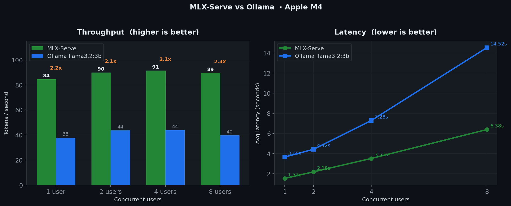
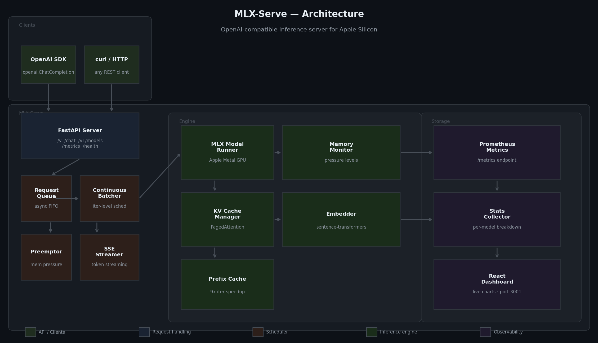

# MLX-Serve ⚡

An OpenAI-compatible LLM inference server built for Apple Silicon using MLX.

> The missing piece between training ([FineTuneKit](https://github.com/TDevViper/FineTuneKit)) and orchestration ([ASTRA](https://github.com/TDevViper/ASTRA)) — a production-grade serving layer for on-device LLMs.

## Benchmarks

> Apple M4 · MLX-Serve vs Ollama · 128 output tokens · 3 rounds per concurrency level

| Concurrency | MLX-Serve tok/s | Ollama tok/s | MLX-Serve lat | Ollama lat | Speedup |
|-------------|----------------|--------------|---------------|------------|---------|
| 1 user      | 84.4           | 37.8         | 1.52s         | 3.65s      | **2.2x** |
| 2 users     | 89.8           | 43.5         | 2.18s         | 4.42s      | **2.1x** |
| 4 users     | 91.4           | 43.7         | 3.51s         | 7.28s      | **2.1x** |
| 8 users     | 89.4           | 39.5         | 6.38s         | 14.52s     | **2.3x** |

MLX-Serve sustains ~90 tok/s flat across all concurrency levels via continuous batching.
Ollama degrades under load — latency doubles from 1 to 8 users. MLX-Serve scales linearly.

## Architecture

## Features

| Feature | Detail |
|---------|--------|
| OpenAI-compatible API | /v1/chat/completions, /v1/completions, /v1/models, /v1/embeddings |
| MLX backend | Runs natively on Apple Silicon Metal GPU |
| Sub-second load time | Model ready in under 1 second |
| Request queue + SSE streaming | Token-by-token streaming, concurrent handling |
| Prometheus metrics | /metrics, tokens/sec, latency, p99 |
| KV cache manager | PagedAttention-style block allocator with LRU eviction |
| Memory monitor + preemption | Pressure levels, auto-preemptor |
| Continuous batching | Iteration-level scheduling, multiple sequences per step |
| Prefix caching | 9x iteration speedup on shared prompt prefixes |
| React dashboard | Live metrics, charts, queue depth, memory gauge |

## Quickstart

git clone https://github.com/TDevViper/MLX-Serve.git
cd MLX-Serve
python3 -m venv .venv && source .venv/bin/activate
pip install -r requirements.txt
python main.py

## API Surface

GET  /health
GET  /metrics
GET  /v1/models
POST /v1/chat/completions
POST /v1/chat/completions/batched
POST /v1/completions
POST /v1/embeddings
GET  /v1/stats
GET  /v1/kv_cache
GET  /v1/memory
GET  /v1/batcher
GET  /v1/prefix_cache

## Requirements

- Apple Silicon Mac (M1/M2/M3/M4)
- Python 3.10+
- Node.js 18+ (dashboard only)

## Ecosystem

FineTuneKit  ->  fine-tune a model on your data
MLX-Serve    ->  serve it at production throughput   <- you are here
ASTRA        ->  build an agent on top of it

---
Built on Apple Silicon · MIT License
